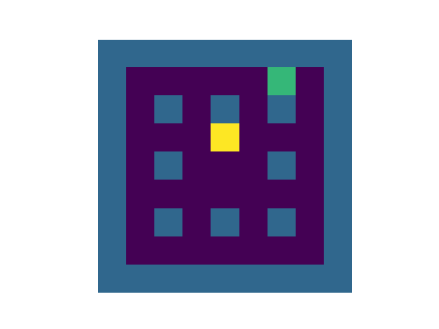
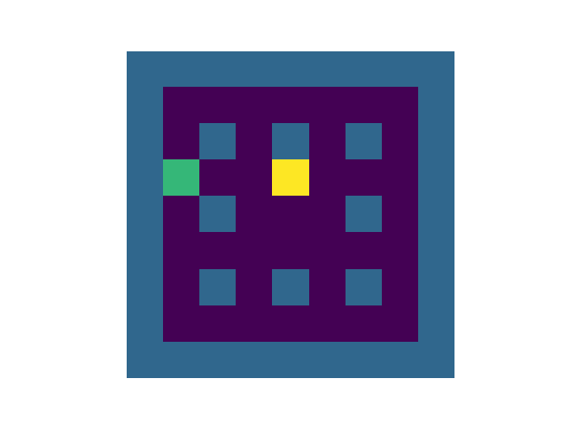

# Maze task

This code performs the grid-maze task, in which the agent must locate a reward and then navigate back to it repeatedly (while being randomly relocated each time it finds it).

Episode 1:

Episode 300000:

